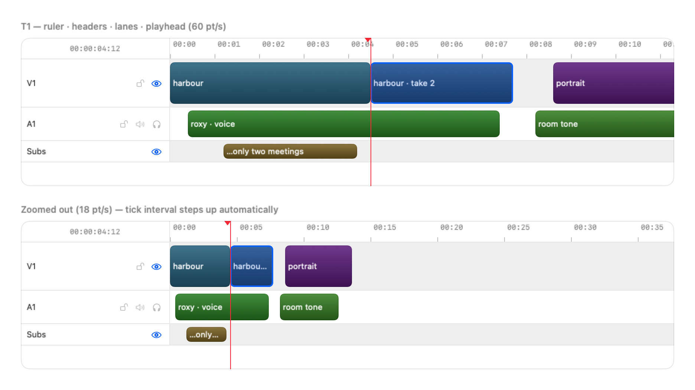

# Timeline

`DesignScaffoldTimeline` — a media-agnostic multi-track timeline: ruler, track headers,
clip lanes, playhead. Generic over a clip model the consumer supplies.

<picture>
  <source media="(prefers-color-scheme: dark)" srcset="images/timeline-dark.png">
  
</picture>

*Two zoom levels of the same edit. The tick interval steps 1s → 5s on its own; everything
else is identical because it all derives from one geometry.*

> **Status: T1 + T2.** Ruler (adaptive ticks, timecode, click/drag scrub) · track headers ·
> clip lanes · playhead · zoom · **drag, cross-track move, edge-drag trim, snapping with
> pluggable sources, trackpad scroll + pinch**. **T3** adds in/out brackets, gap indicators,
> marquee select and row-height resize.

## Scope — what this owns, and what it deliberately does not

| The scaffold owns | The consumer owns |
|---|---|
| Ruler, ticks, timecode, scrub | What a clip *means* — filmstrips, waveforms, take chips |
| Track headers and state controls | Generation overlays, resolution stripes, transition ramps |
| Lane layout, clip placement/sizing | The clip body view, entirely |
| Playhead, zoom, selection, (T2) drag/trim/snap | Monitors, inspectors, the tool rail |

The tool rail on the spec artboard is **app chrome** — place the timeline beside your own
rail. It is drawn there for context, not as a component boundary.

## Usage

```swift
import DesignScaffoldTimeline

struct Clip: TimelineClip {          // the whole contract
    let id: UUID
    var start: TimeInterval
    var duration: TimeInterval
    var trackIndex: Int
    var asset: Asset                 // …and whatever else you need
}

@State private var geometry = TimelineGeometry(pointsPerSecond: 60)
@State private var playhead: TimeInterval = 0
@State private var selection: Set<Clip.ID> = []

TimelineView(tracks: tracks, clips: clips,
             geometry: $geometry, playhead: $playhead, selection: $selection) { clip in
    Filmstrip(clip.asset)            // you draw the inside
}
.frameRate(24)
.onToggleControl { track, control in model.toggle(control, on: track) }
```

Tracks declare which state controls their header offers, so an audio row can show
mute/solo while a subtitle row shows only enable:

```swift
TimelineTrack(id: "a1", name: "A1", kind: .audio, controls: [.mute, .solo, .lock])
```

`Kind` sets the default row height (video 64, audio 44, subtitle 28); set `height`
explicitly to override. A `headerAccessory` ViewBuilder carries anything app-specific —
the spec's source-patch picker, for instance.

## One geometry, therefore no scroll sync

Ruler, headers and lanes all read a single ``TimelineGeometry`` (`pointsPerSecond` +
`visibleStart`). Panning and zooming are writes to that one value, so the three surfaces
cannot drift apart — **there are no scroll offsets to reconcile.** A nested-ScrollView
design has to solve that problem continuously; this one cannot have it. It also gives
virtualisation for free: lanes build only the clips intersecting the viewport.

```swift
geometry.zoom(to: 120, keeping: playhead)   // anchored zoom — the anchor stays put
geometry.scroll(to: 30)                     // never negative
```

## The snapping rule

**The snap threshold is expressed in POINTS and converted to time at the current zoom:**

```swift
let tolerance = geometry.seconds(forPoints: theme.snapThreshold)   // 8pt, always
```

A hardcoded seconds threshold drifts badly at the extremes — 0.2s is 2pt at 10pt/s
(imperceptible) and 80pt at 400pt/s (grabs everything). Points-in, seconds-out keeps the
*feel* identical at every zoom, and it is unit-tested across three orders of magnitude.
(T2 wires the pluggable snap sources on top of this; the conversion already exists so
consumers can build against it now.)

## Theming — and two documented departures from the spec

`TimelineTheme`'s initializer defaults are the token values. Two spec values were changed
on the way in rather than applied silently:

| Spec says | Ships as | Why |
|---|---|---|
| selection `accentFigma` (#0091ff literal) | `Tokens.Color.accent` | The system accent keeps the timeline consistent with every other component and honours the user's accent + Increase Contrast. Overriding is one line — see the collision note below. |
| playhead "`failure` #ff4245" | its own literal (same value) | A playhead is not an error. Binding it to the failure semantic means a future change to error red silently moves the playhead. Same colour today, independent meaning. |

### ⚠️ When to override the selection colour

**The playhead is red, and the selection follows the user's system accent — so a user
whose accent is red or orange gets selection chrome that reads as a playhead.** On a
colour-critical editing surface that is a real misread, not a taste issue.

The library still defaults to the system accent (consistency and accessibility win by
default), but if your timeline is a precision editing surface, pin the selection:

```swift
var theme = TimelineTheme.scaffold
theme.selection = Tokens.Color.accentFigma   // fixed blue: cannot collide with the playhead
```

This is the intended shape of the exception — an app-level override for an app-specific
collision, rather than the library abandoning semantics for everyone. (Raised by ML[X] LTX
Studio on AB-A-0031, and it applies to any consumer with a red playhead.)

## Editing — drag, cross-track, trim

Gestures compute a **result** and report it; the component never mutates your model. While
a gesture runs the clip follows the cursor from the timeline's own state, so the edit
previews without a round trip — and a clip dragged onto another track renders in the
destination lane rather than being clipped by its origin.

```swift
TimelineView(...)
    .snapSources([.clipEdges(clips), .playhead(playhead), .origin])
    .minimumClipDuration(0.1)
    .onMove { id, start, trackIndex in document.move(id, to: start, on: trackIndex) }
    .onTrim { id, start, duration in document.retime(id, start: start, duration: duration) }
```

Neither callback fires when a gesture ends where it started. Which callback fires is
decided by **which gesture ran**, recorded on the draft — not by diffing the result, which
misreports the edge cases (a trim that lands on the original duration, a zero-length move).

A **leading trim holds the tail still** and a trailing trim holds the head still; that is
what makes a trim read as a trim rather than a move. Both respect `minimumClipDuration`,
and a leading trim cannot drag the head below zero.

Cross-track resolution walks the **real row heights** rather than dividing by a constant:
rows are 64/44/28, so a fixed divisor drifts as the drag crosses rows of different kinds.
The boundary between two rows is the mean of their heights.

## Snapping — pluggable, and always in points

A snap source is just a closure returning candidate times for the visible range, so you
contribute your own without the component knowing what they mean:

```swift
.snapSources([
    .clipEdges(clips, excluding: draggedID),   // a clip must not snap to itself
    .playhead(playhead),
    .origin,                                   // seat against the head of the timeline
    .fixed(markers),
    TimelineSnapSource { visible in beatGrid(in: visible) },   // anything you like
])
```

Passing no sources (the default) disables snapping entirely.

**Both clip edges compete.** A clip snaps when *either* its head or its tail comes near a
candidate, and the closer edge wins — snapping only the head would leave a clip's tail
visibly short of the next clip's head, which is the case an editor cares most about. A
trim, by contrast, snaps only the edge being dragged; snapping the far edge would move the
side the user is holding still.

The tolerance is `theme.snapThreshold` (8pt) converted through
`geometry.seconds(forPoints:)` — **no API anywhere stores a duration**. A hairline marks the
snapped time while a gesture is snapped, because snapping that is felt but not seen cannot
be told apart from a coincidence.

## Trackpad

Horizontal two-finger scroll pans and pinch zooms (anchored under the fingers). Vertical
scrolling is left to the host, by request.

This is implemented with a **local event monitor**, not an overlay that overrides
`scrollWheel(with:)`. The overlay is the obvious approach and does not work: to receive
scroll events a view must be the hit view, and a view that is the hit view also swallows
the clicks the lanes need. The monitor sees events without touching hit testing, and
filters to its own window and frame so it never steals scroll from the rest of the app.

## Time base — seconds here, exactness in your document

``TimelineClip`` speaks `TimeInterval` **seconds**, deliberately: this component is
cross-media, and an audio consumer has no frame grid to quantise to.

If your document has an exact time base — integer ticks, or frames at 23.976/29.97 —
**keep that base authoritative and convert at the view boundary.** Do not let display
seconds round-trip back into the model: `Double` seconds cannot represent 1/1001-family
rates exactly, and edit boundaries that survive a round trip through them will drift.
Convert in, convert out, and let the timeline own only what it draws.

(ML[X] LTX Studio does exactly this from a 120,000/s tick base — flagged on AB-A-0031 as a
deliberate adaptation rather than a surprise.)

## Under the hood

`TimelineGeometry`, `TickScale` and `Timecode` are pure value types with 22 unit tests —
the time⇄points mapping, zoom clamping and anchoring, viewport virtualisation, the
points-based snap conversion, tick-ladder selection, and timecode formatting.

One behaviour worth knowing: the ruler always includes the aligned tick **at or before**
the left edge, because a tick's label is drawn to its right and can still be on screen.
An earlier version admitted it only within half an interval, which made the leading label
blink in and out as the scroll moved within a single interval.
