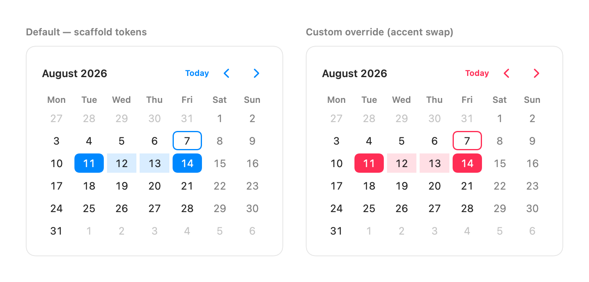
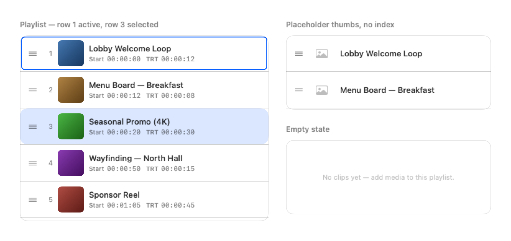
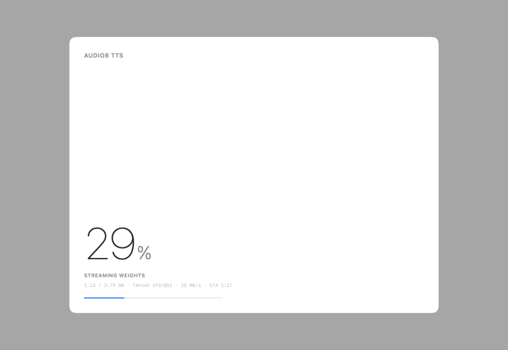
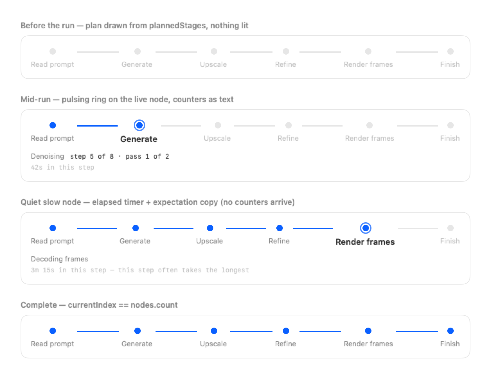
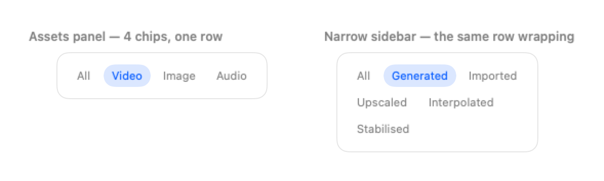

# DesignScaffold

The shared macOS design vocabulary for the fleet's demo and harness apps — extracted from
Apple's macOS 26/27 UI kit in Figma rather than estimated by eye — plus components dressed
in those tokens, shipped as separately selectable libraries.

**[Docs/COMPONENTS.md](Docs/COMPONENTS.md) is the fleet catalog** — what exists, how to adopt
it, and how to request something new. Look there before building a macOS UI surface.

## Products

| Library | What you get |
|---|---|
| `DesignScaffold` | `Tokens` + `cardSurface()` — the vocabulary |
| `DesignScaffoldCalendar` | Month calendar (single/multiple/range selection) in the house style; re-exports `DesignScaffold` |
| `DesignScaffoldPlaylist` | `PlaylistIterator` — sortable playlist list (thumbnail · name · metadata, drag-reorder, active marker); re-exports `DesignScaffold` |
| `DesignScaffoldLoading` | `LoadingCard` + `.loadingModal(...)` — model/product loading modal (hero percentage · status · fields · bar); re-exports `DesignScaffold` |
| `DesignScaffoldStageStepper` | `StageStepper` — run-progress stepper for multi-phase operations (planned nodes · pulse · counters); re-exports `DesignScaffold` |
| `DesignScaffoldChips` | `ChipRow` — capsule filter chips, single-select, wrapping; re-exports `DesignScaffold` |
| `DesignScaffoldTimeline` | `TimelineView` — media-agnostic multi-track timeline (ruler · headers · clip lanes · playhead), generic over your clip model; re-exports `DesignScaffold` |

In Xcode's package sheet, select only the libraries the app uses.

**The package is self-contained: zero external dependencies (SwiftUI only), by policy.**
Adopting any product never pulls in MLXEngine, a model package, or anything else.
Components are *vendored* — each one is its own target and selectable library, with its
look resolved through the tokens. The calendar was absorbed from SwiftCalendarKit (our
vanilla-calendar-pro port, now deprecated in favour of this copy); future components
follow the same pattern: new target, new selectable product, tokens win.

## Why it exists

Every demo app in the fleet was inventing its own spacing scale, radii, and type ramp. They
drifted from each other and from the platform. This package holds one copy, with the Figma
node ids recorded so it can be refreshed rather than re-guessed.

## Provenance

| | |
|---|---|
| File | `Demo Apps` — `LGwpgABHRfxj47V8uCmkwK` |
| Variables | node `9:937` (`Examples/Dialog/Save - Small`) |
| Grouped-form geometry | node `0:112` (`Form Group`) |
| Extracted | 2026-07-30 |

Raw variable dump, for diffing on refresh:

```
Body/Emphasized       SF Pro Semibold 13 / lh 16      Global/Radius      6
Headline/Regular      SF Pro Bold 13 / lh 16          Button/Radius      6
Subheadline/Regular   SF Pro Regular 11 / lh 14       Global/Height     24
Global/Font Size      13                              Cursor/Height     18
Labels/Primary        #ffffffd9                       Fields/Inset-L|R   8
Labels/Secondary      #ffffff8c                       Popup/Inset-Left  12
Window Background     #1e1e1e                         Button/Pad-Horiz  16
Accents/Blue          #0091ff                         Disclosure/Font   13
Accents/Red           #ff4245                         Form group radius 12, row 42, pad 10
Fills-Vibrant/Primary   #242424     Fills-Vibrant/Secondary  #141414
Labels-Vibrant/Primary  #f5f5f5     Labels-Vibrant/Secondary #8a8a8a
Liquid Glass: angle 0 · dispersion 20 · opacity 25 · frost 6 · refraction 70 · splay 20 · depth 30
```

## The colour policy (a judgement call, not a shortcut)

The kit publishes **dark values only**. Several are *exactly* the macOS system semantics:

| Figma | Value | System equivalent |
|---|---|---|
| `Labels/Primary` | `#ffffffd9` | `NSColor.labelColor` (white @ 85%) |
| `Labels/Secondary` | `#ffffff8c` | `NSColor.secondaryLabelColor` (white @ 55%) |
| `Window Background` | `#1e1e1e` | `NSColor.windowBackgroundColor` |

So where a semantic provably equals the token, **the semantic is used** — hardcoding the hex
would pin every app to dark mode and defeat Increase Contrast. The Figma value is recorded
beside it. Only genuinely brand-specific values (the accents) are carried as literals, and even
the blue defaults to the system accent so the user's own accent choice still applies.

Structural tokens — radii, control heights, insets, the type ramp — come straight from the kit.
That is where the estimates had actually been wrong: container radius was guessed at 10, the kit
says **12**.

## Refreshing from Figma

1. Select the relevant frame in Figma desktop (the remote MCP reads the live selection — with
   nothing selected it reports an empty document, which is misleading).
2. `get_variable_defs` on the node for the token values.
3. `get_design_context` on a representative component for geometry the variables don't carry
   (row heights, group padding).
4. Diff against the table above and update `Tokens.swift`.

## Usage

```swift
import DesignScaffold

Text("Real-time factor")
    .font(Tokens.Font.caption)
    .foregroundStyle(Tokens.Color.secondaryLabel)
    .padding(Tokens.Space.m)
    .cardSurface()
```

**House rule:** no view hardcodes a colour, font size, or spacing value. If something is
missing, add it here first — that constraint is what keeps a kit refresh a one-file change.

## Components

Each component ships as its own selectable library, wears the scaffold look **by
default** (no theme call needed — every colour, metric, and font resolves through
`Tokens`), and re-exports `DesignScaffold`. Full instructions live in `Docs/`, one page
per component.

### Calendar — [Docs/Calendar.md](Docs/Calendar.md)

<picture>
  <source media="(prefers-color-scheme: dark)" srcset="Docs/images/calendar-dark.png">
  
</picture>

Month calendar for date, multi-date, and date-range input — the selection mode follows
from which binding you pass. First weekday, locale, bounds, disabled dates, and week
numbers are chainable modifiers; the grid math and selection rules are pure,
unit-tested value types.

```swift
import DesignScaffoldCalendar

@State private var range: ClosedRange<Date>?

CalendarView(range: $range)
    .firstWeekday(.monday)
    .disabledWeekdays(Weekday.weekend)
    .padding(Tokens.Space.s)
    .cardSurface()
```

### Playlist iterator — [Docs/PlaylistIterator.md](Docs/PlaylistIterator.md)

<picture>
  <source media="(prefers-color-scheme: dark)" srcset="Docs/images/playlist-dark.png">
  
</picture>

Sortable playlist list — rows of thumbnail · name · metadata with drag-to-reorder, tap
selection, and a distinct ACTIVE (now-playing) accent ring. Reorders live as the dragged
row passes neighbours and commits once on drop; the move rule is pure and unit-tested.
`Item` is your own `Identifiable` model, and thumbnails arrive as a `ViewBuilder`.

```swift
import DesignScaffoldPlaylist

PlaylistIterator(
    items: $clips, selection: $selectedId, active: nowPlayingId,
    name: { $0.title },
    metadata: { [PlaylistMetadatum("TRT", $0.runtime)] }
) { clip in
    clip.artwork.resizable().scaledToFill()
}
.onReorder { reordered in persist(reordered.map(\.id)) }
.clipShape(RoundedRectangle(cornerRadius: Tokens.Radius.container))
.cardSurface()
```

### Loading modal — [Docs/LoadingModal.md](Docs/LoadingModal.md)

<picture>
  <source media="(prefers-color-scheme: dark)" srcset="Docs/images/loading-dark.png">
  
</picture>

Modal loading card for model/product loads — display-size percentage, uppercase status,
dot-separated detail fields, thin progress bar, on an 800×600 card with a slot for
full-bleed art behind a legibility scrim. You pass in the percentage and the fields;
formatting is the app's business. No close affordance on purpose — dismissal is the
load's job.

```swift
import DesignScaffoldLoading

MyAppContent()
    .loadingModal(
        isPresented: loading,
        progress: LoadingProgress(fraction: 0.29,
                                  status: "Streaming weights",
                                  fields: ["1.13 / 3.79 GB", "ETA 1:17"]),
        title: "Audio8 TTS")
```

### Stage stepper — [Docs/StageStepper.md](Docs/StageStepper.md)

<picture>
  <source media="(prefers-color-scheme: dark)" srcset="Docs/images/stepper-dark.png">
  
</picture>

Run-progress for a multi-phase operation — the planned nodes drawn up front, a pulsing
ring on the live one, counters as text, and an elapsed timer when a node runs long.
Encodes a measured contract: **never a percentage synthesised across phases** (they are
unequal in time, so such a bar races then freezes), and the quietest node gets the
strongest still-working affordance. Engine-free — event correlation stays in the host.

```swift
import DesignScaffoldStageStepper

StageStepper(progress: StageProgress(
    nodes: plan,                                  // known before the run starts
    currentIndex: reachedIndex,                   // monotonic; nodes.count == complete
    counterText: "step 5 of 8 · pass 1 of 2",
    elapsedInNode: elapsed))
```

### Timeline — [Docs/Timeline.md](Docs/Timeline.md)

<picture>
  <source media="(prefers-color-scheme: dark)" srcset="Docs/images/timeline-dark.png">
  
</picture>

Multi-track timeline chrome — ruler with adaptive ticks and scrub, track headers with
state controls, clip lanes, playhead, zoom — generic over a clip model you supply, with a
ViewBuilder for the clip body. Ruler, headers and lanes all derive from **one geometry**,
so there are no scroll offsets to keep in sync and virtualisation comes free. The snap
threshold is expressed in **points** and converted per zoom, so snap feel is identical at
every zoom level.

```swift
import DesignScaffoldTimeline

TimelineView(tracks: tracks, clips: clips,
             geometry: $geometry, playhead: $playhead, selection: $selection) { clip in
    Filmstrip(clip.asset)        // you draw the inside; the scaffold places it
}
```

### Chip row — [Docs/ChipRow.md](Docs/ChipRow.md)

<picture>
  <source media="(prefers-color-scheme: dark)" srcset="Docs/images/chips-dark.png">
  
</picture>

Capsule filter chips, single-select, generic over any `Identifiable` collection. Wraps via a
real `Layout` rather than scrolling — a filter row that scrolls hides its own options.

```swift
import DesignScaffoldChips

ChipRow(Kind.allCases, selection: $kind) { $0.rawValue.capitalized }
```

## Adopters

Detected, not hand-kept — see the **Who has adopted** section of
[Docs/COMPONENTS.md](Docs/COMPONENTS.md), regenerated by `Tools/scan-adopters.py`.

(This list was previously maintained by hand and was wrong: it named an app that had
forked the vocabulary into its own `enum Tokens` rather than consuming the package. That
is exactly the rot the derived catalog exists to prevent — including in our own docs.)

## License

MIT — see [LICENSE](LICENSE).
